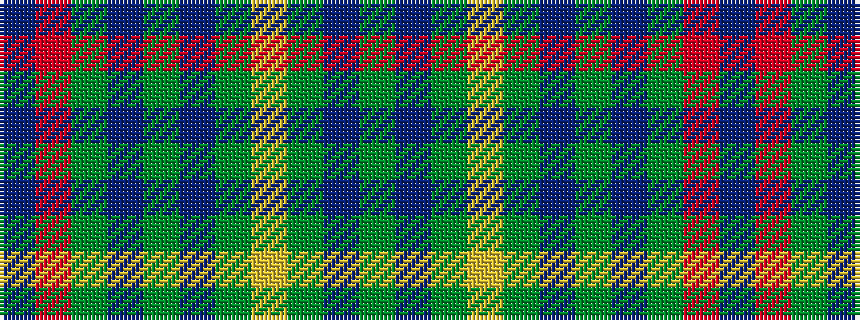

BRGBGBGYGBG

It is a 11 stripe tartan.

<figure class="pat-woven">

<figcaption>idealised sample</figcaption>
</figure>

## Colour Sequence



## Tartans with this colour sequence

| Tartans |
|---------------|
| [Greyfriars](/setts/s11/b30o6dy16dp8dg10dp14dg24lo4dy10dp3dy28/)|
||
