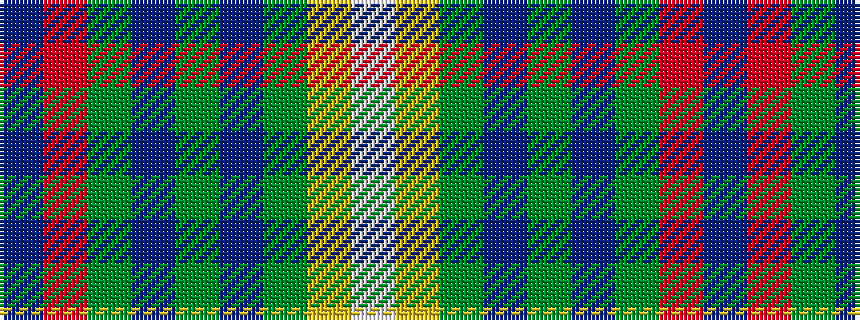

BRGBGBGYW

It is a 9 stripe tartan.

<figure class="pat-woven">

<figcaption>idealised sample</figcaption>
</figure>

## Colour Sequence



## Tartans with this colour sequence

| Tartans |
|---------------|
| [Bundanoon](/setts/s9/db17r3dg55db3dg4db3dg4ly3w5~x2/)|
||
| [Bundanoon (District)](/setts/s9/db17r3g55db3g4db3g4ly3w5~x2/)|
||
