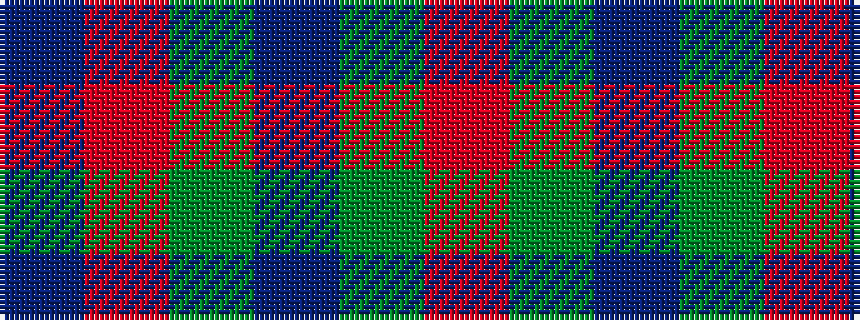

BRGBGR

It is a 6 stripe tartan.

<figure class="pat-woven">

<figcaption>idealised sample</figcaption>
</figure>

## Colour Sequence



## Tartans with this colour sequence

| Tartans |
|---------------|
| [Perthshire (New) District Tartan](/variants/s6/db26r6g16db8g3r2~x2/)|
||
| [Perthshire Tourist Board (Corporate)](/variants/s6/dp26r6g16dp8g3r2~x2/)|
||
| [Perthshire, New /Tourist Board](/variants/s6/db37r10dg22db11dg3r3~x2/)|
||
