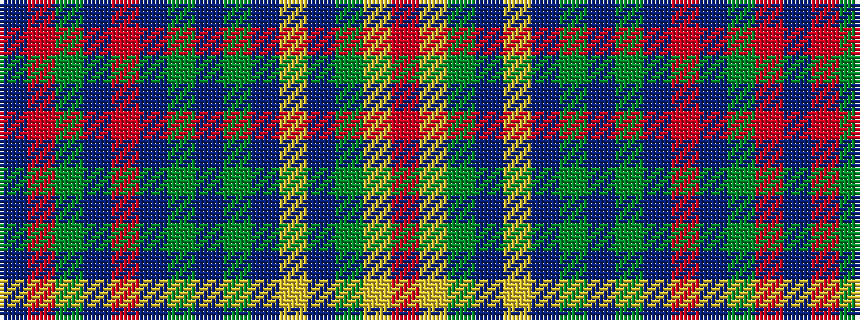

BRGBRBGBGBYBGYR

It is a 15 stripe tartan.

<figure class="pat-woven">

<figcaption>idealised sample</figcaption>
</figure>

## Colour Sequence



## Tartans with this colour sequence

| Tartans |
|---------------|
| [Howells](/setts/s15/n16r1dg3n5r1n5dg3n4dg12n14ly1n14dg12ly2r6~x2/)|
||
