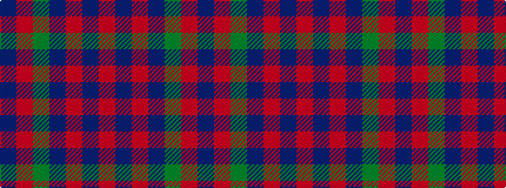

BRGBRBR

It is a 7 stripe tartan.

<figure class="pat-woven">

<figcaption>idealised sample</figcaption>
</figure>

## Colour Sequence



## Tartans with this colour sequence

| Tartans |
|---------------|
| [Robertson of Struan 1816](/variants/s7/r3db1r1db11g10r2db2~x4/)|
||
