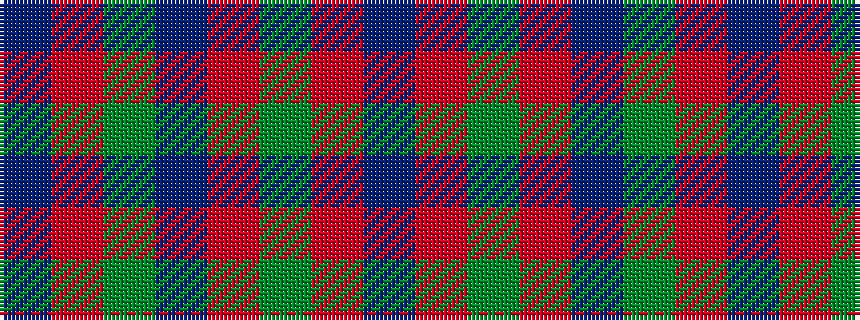

BRGBRGRB

It is a 8 stripe tartan.

<figure class="pat-woven">

<figcaption>idealised sample</figcaption>
</figure>

## Colour Sequence



## Tartans with this colour sequence

| Tartans |
|---------------|
| [Robb Dress (Personal)](/setts/s8/dp2r1dg26r18dp26y1r1dp2~x2/)|
||
