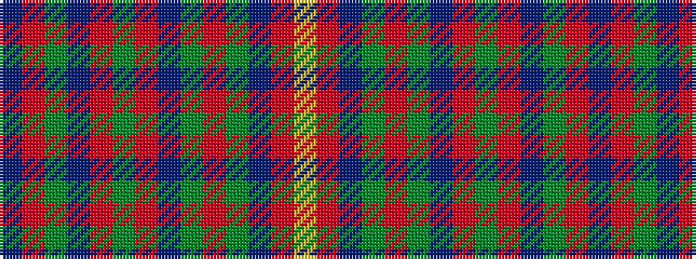

BRGBRGRBGRGBRY

It is a 14 stripe tartan.

<figure class="pat-woven">

<figcaption>idealised sample</figcaption>
</figure>

## Colour Sequence



## Tartans with this colour sequence

| Tartans |
|---------------|
| [MacKinnon](/tartans/n2r3dg2db2r6dg16r2db4dg2r16dg8n2r4lr2/)|
||
