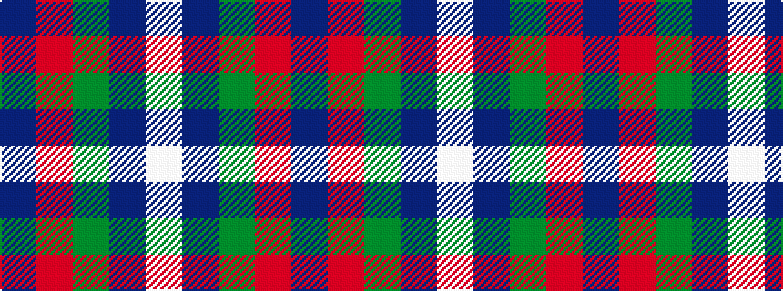

BRGBW

It is a 5 stripe tartan.

<figure class="pat-woven">

<figcaption>idealised sample</figcaption>
</figure>

## Colour Sequence



## Tartans with this colour sequence

| Tartans |
|---------------|
| [Battle of Prestonpans (1745) Herit](/variants/s5/db9r12dg9db5w2~x4/)|
||
| [Battle of Prestonpans (1745) Heritage Trust, The](/variants/s5/db9r12g9db5w2~x4/)|
||
