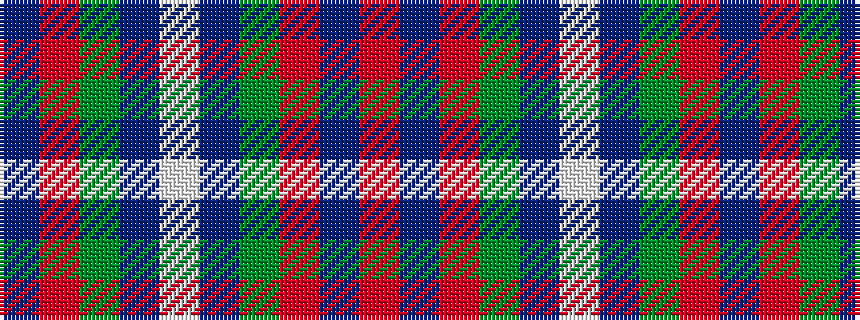

BRGBWBGRBR

It is a 10 stripe tartan.

<figure class="pat-woven">

<figcaption>idealised sample</figcaption>
</figure>

## Colour Sequence



## Tartans with this colour sequence

| Tartans |
|---------------|
| [Wilton (Toronto) (Personal)](/variants/s10/n9r1g9db19w2db19g9r1n9ri1~x2/)|
||
