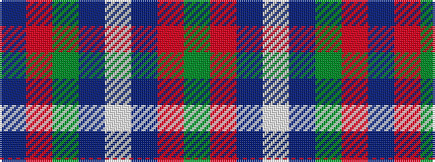

BRGBWBRG

It is a 8 stripe tartan.

<figure class="pat-woven">

<figcaption>idealised sample</figcaption>
</figure>

## Colour Sequence



## Tartans with this colour sequence

| Tartans |
|---------------|
| [MacHardy](/variants/s8/db3r3g18db16w2db26r3g3~x2/)|
||
| [MacHardy (Clan)](/variants/s8/dt6r3g26dt26w2dt27r5g5~x2/)|
||
| [MacHardy, Blue](/variants/s8/db6r3g26db26w4db26r5g5~x2/)|
||
