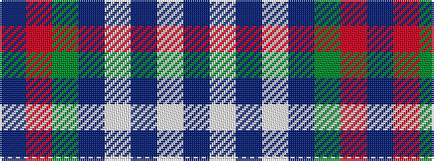

BRGBWBWB

It is a 8 stripe tartan.

<figure class="pat-woven">

<figcaption>idealised sample</figcaption>
</figure>

## Colour Sequence



## Tartans with this colour sequence

| Tartans |
|---------------|
| [Colvin](/variants/s8/db36lb4db4lb4db16dg64r9db6~x2/)|
||
| [Roxburgh](/variants/s8/db16w1db1w1db8dg16r1db2~x2/)|
||
| [Roxburgh](/variants/s8/db16w1db1w1db8g16r1db2~x2/)|
||
| [Roxburgh, Green (District)](/variants/s8/db23w1db1w1db8g22r1db3~x4/)|
||
