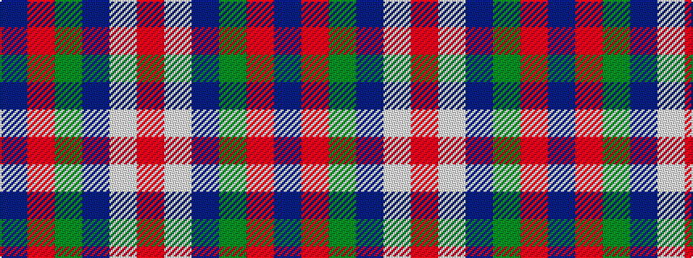

BRGBWR

It is a 6 stripe tartan.

<figure class="pat-woven">

<figcaption>idealised sample</figcaption>
</figure>

## Colour Sequence



## Tartans with this colour sequence

| Tartans |
|---------------|
| [MacIntosh, dress](/variants/s6/r3w8db4g14r4db2~x2/)|
||
| [MacKintosh Dress (Scott Adie)](/variants/s6/r3w8db4dg14r4db2~x4/)|
||
