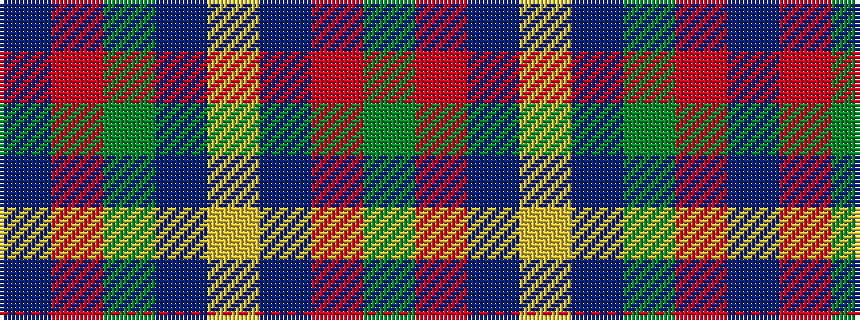

BRGBYBRG

It is a 8 stripe tartan.

<figure class="pat-woven">

<figcaption>idealised sample</figcaption>
</figure>

## Colour Sequence



## Tartans with this colour sequence

| Tartans |
|---------------|
| [MacHardy](/setts/s8/dg1r1db6ly1db6dg6r1db1~x2/)|
||
| [MacHardy](/setts/s8/db1r1g6db6ly1db6r1g1~x2/)|
||
