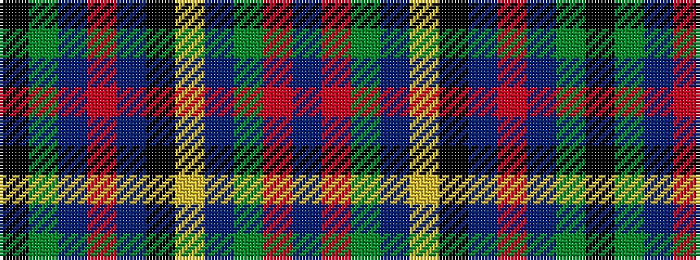

BRGBYKBRBGK

It is a 11 stripe tartan.

<figure class="pat-woven">

<figcaption>idealised sample</figcaption>
</figure>

## Colour Sequence



## Tartans with this colour sequence

| Tartans |
|---------------|
| [Stephenson](/setts/s11/k6g20t2r5t2k20ly3db20g26r3db5~x2/)|
||
| [Stephenson (Name)](/setts/s11/k6g20b2r5b2k20lo3db20g26r3db5~x2/)|
||
| [Stevenson](/setts/s11/k6g20t2r6t2k20ly3db20g26r3db6~x2/)|
||
