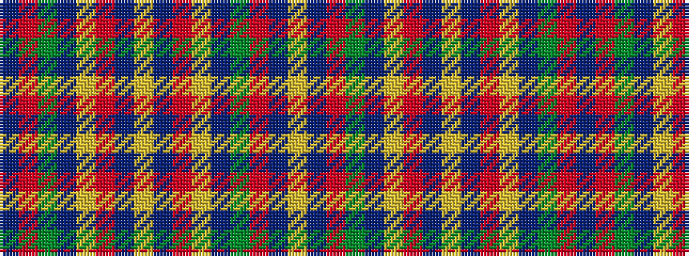

BRGBYRBYBRYBGRBY

It is a 16 stripe tartan.

<figure class="pat-woven">

<figcaption>idealised sample</figcaption>
</figure>

## Colour Sequence



## Tartans with this colour sequence

| Tartans |
|---------------|
| [Monaghan, County](/setts/s16/lo3do2o14lo8do14dg16o13do2lo3~x2/)|
||
