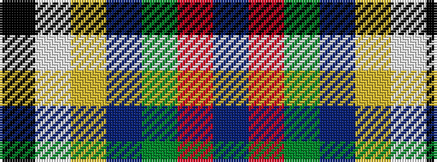

BRGBYWK

It is a 7 stripe tartan.

<figure class="pat-woven">

<figcaption>idealised sample</figcaption>
</figure>

## Colour Sequence



## Tartans with this colour sequence

| Tartans |
|---------------|
| [Nicolson of Assynt & Coigach (Name)](/variants/s7/db8r11g5dbi3ly3w5k3~x2/)|
||
