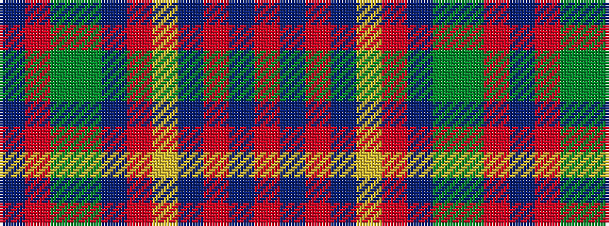

BRGGBRYBRBR

It is a 11 stripe tartan.

<figure class="pat-woven">

<figcaption>idealised sample</figcaption>
</figure>

## Colour Sequence



## Tartans with this colour sequence

| Tartans |
|---------------|
| [Dundee Carers Centre](/setts/s11/m66db2ri14db2ly5r8db12dgi10dg60m4db25/)|
||
