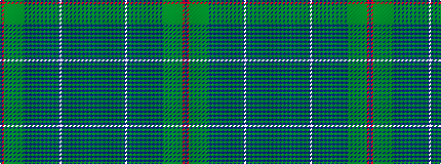

BRGGGGGGGGGGBGBGBGBGBGBGBGBGBWBGBGBGBGBGBGBGBG

It is a 46 stripe tartan.

<figure class="pat-woven">

<figcaption>idealised sample</figcaption>
</figure>

## Colour Sequence



## Tartans with this colour sequence

| Tartans |
|---------------|
| [Virginia (Fashion)](/variants/s46/dp32m16g8gi1g1gi1g1gi1g1gi1g1gi16b1gi1b1gi1b1gi1b1gi1b1gi1b1gi1b1gi1b1gi1b16lb32b16gi1b1gi1b1gi1b1gi1b1gi1b1gi1b1gi1b1gi1/)|
||
