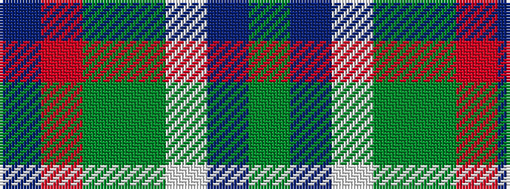

BRGGWBG

It is a 7 stripe tartan.

<figure class="pat-woven">

<figcaption>idealised sample</figcaption>
</figure>

## Colour Sequence



## Tartans with this colour sequence

| Tartans |
|---------------|
| [Lindley-Highfield (Name)](/setts/s7/dg7dp3w1g2dg1r2dp1~x8/)|
||
