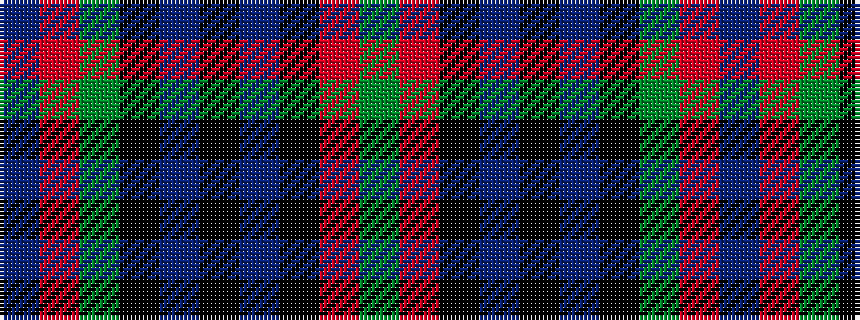

BRGKBKBKRG

It is a 10 stripe tartan.

<figure class="pat-woven">

<figcaption>idealised sample</figcaption>
</figure>

## Colour Sequence



## Tartans with this colour sequence

| Tartans |
|---------------|
| [Famous Grouse, The](/variants/s10/dp3m4g26k3dp4k16dp4k3m26g2~x2/)|
||
| [Matthew Gloag](/variants/s10/g3r20k2db3k13db3k2g20r3db2~x2/)|
||
| [Matthew Gloag & Son Ltd (Corporate)](/variants/s10/g3r20k2dt3k12dt3k2g20r3dt2~x2/)|
||
