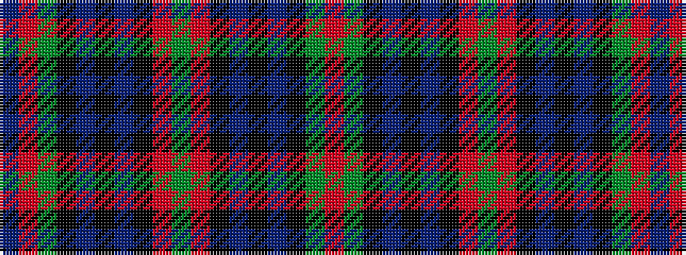

BRGKBKBKRGRKBKBKGR

It is a 18 stripe tartan.

<figure class="pat-woven">

<figcaption>idealised sample</figcaption>
</figure>

## Colour Sequence



## Tartans with this colour sequence

| Tartans |
|---------------|
| [Matthew Gloag Corporate Tartan](/variants/s18/r3g20k2dt3k12dt3k2r20g3r20k2dt3k12dt3k2g20r3dt2~x2/)|
||
