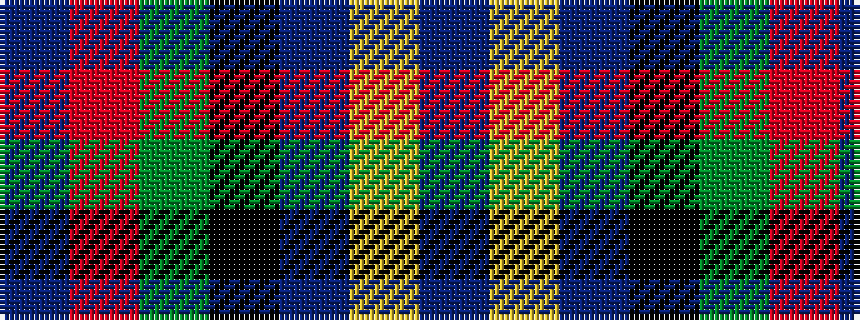

BRGKBYB

It is a 7 stripe tartan.

<figure class="pat-woven">

<figcaption>idealised sample</figcaption>
</figure>

## Colour Sequence



## Tartans with this colour sequence

| Tartans |
|---------------|
| [Dundas](/variants/s7/db9r24dg24k24db24ly2db9/)|
||
| [Dundas](/variants/s7/db9r24g24k24db24ly2db9/)|
||
