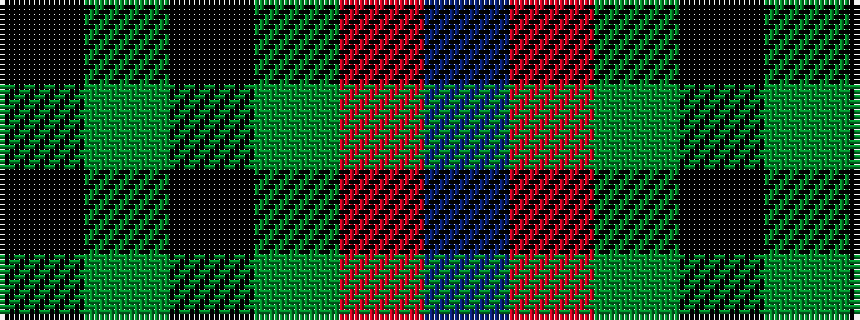

BRGKGK

It is a 6 stripe tartan.

<figure class="pat-woven">

<figcaption>idealised sample</figcaption>
</figure>

## Colour Sequence



## Tartans with this colour sequence

| Tartans |
|---------------|
| [Denny Hunting](/variants/s6/k4dg5k2dg5r17db2~x2/)|
||
| [Denny, hunting](/variants/s6/k1g6k1g6r16db1~x2/)|
||
