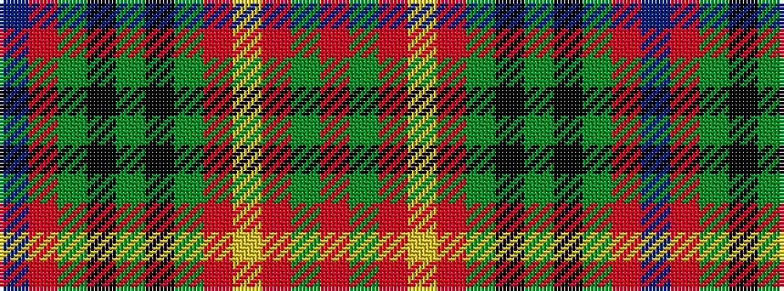

BRGKGKGRYRGR

It is a 12 stripe tartan.

<figure class="pat-woven">

<figcaption>idealised sample</figcaption>
</figure>

## Colour Sequence



## Tartans with this colour sequence

| Tartans |
|---------------|
| [Buchanan, hunting](/variants/s12/o12g6o6ly1o6g6k6g4k6g6o6t1~x2/)|
||
