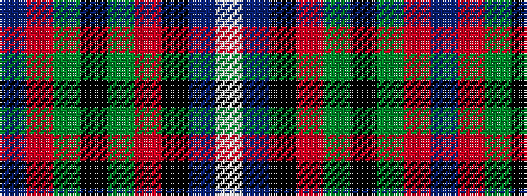

BRGKGRKBW

It is a 9 stripe tartan.

<figure class="pat-woven">

<figcaption>idealised sample</figcaption>
</figure>

## Colour Sequence



## Tartans with this colour sequence

| Tartans |
|---------------|
| [Bush Pilot](/setts/s9/db1r20g6k6g6r1k6db20w1~x2/)|
||
