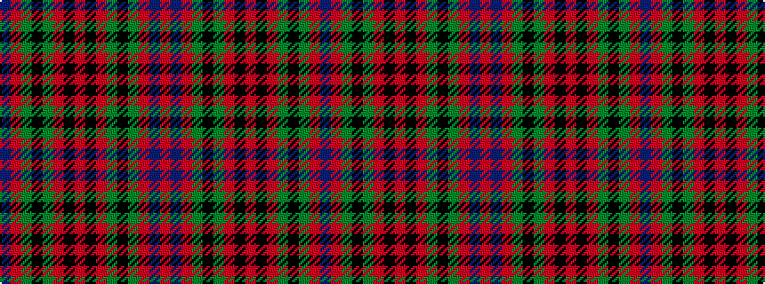

BRGKGRKRKRGKGRBR

It is a 16 stripe tartan.

<figure class="pat-woven">

<figcaption>idealised sample</figcaption>
</figure>

## Colour Sequence



## Tartans with this colour sequence

| Tartans |
|---------------|
| [Oriel #1](/variants/s16/r12db2r3g20k4g20r30k2r1~x2/)|
||
