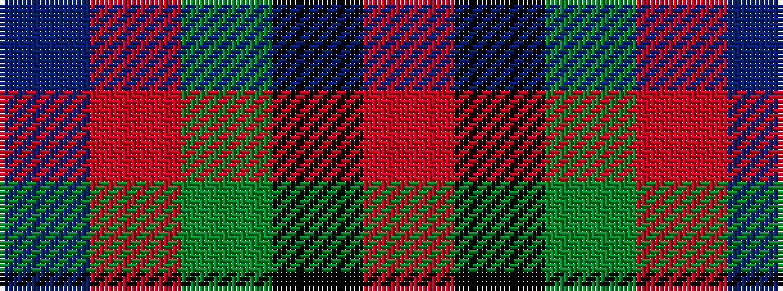

BRGKR

It is a 5 stripe tartan.

<figure class="pat-woven">

<figcaption>idealised sample</figcaption>
</figure>

## Colour Sequence



## Tartans with this colour sequence

| Tartans |
|---------------|
| [Skene of Cromar](/setts/s5/db2r20g20k21r1~x2/)|
||
| [Skene of Cromar (1885)](/setts/s5/db2r20dg20k21r1~x2/)|
||
