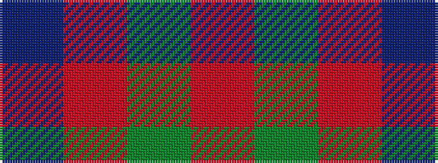

BRGR

It is a 4 stripe tartan.

<figure class="pat-woven">

<figcaption>idealised sample</figcaption>
</figure>

## Colour Sequence



## Tartans with this colour sequence

| Tartans |
|---------------|
| [Wilson's No.161](/setts/s4/g13r2t13~x2/)|
||
| [Wilson's No.212](/setts/s4/r2g9r2t2~x4/)|
||
