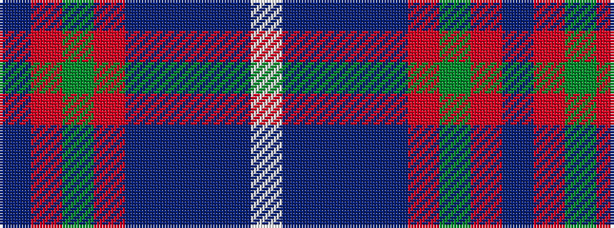

BRGRBBBBW

It is a 9 stripe tartan.

<figure class="pat-woven">

<figcaption>idealised sample</figcaption>
</figure>

## Colour Sequence



## Tartans with this colour sequence

| Tartans |
|---------------|
| [Japan-Scotland Society (Corporate)](/variants/s9/dp12r1g4r2dp10t20db3t9w1~x2/)|
||
