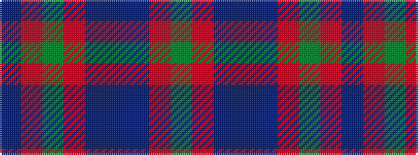

BRGRBBBRG

It is a 9 stripe tartan.

<figure class="pat-woven">

<figcaption>idealised sample</figcaption>
</figure>

## Colour Sequence



## Tartans with this colour sequence

| Tartans |
|---------------|
| [Hebridean 1](/setts/s9/db2r3g11r3db2t2db11r2g2~x2/)|
||
