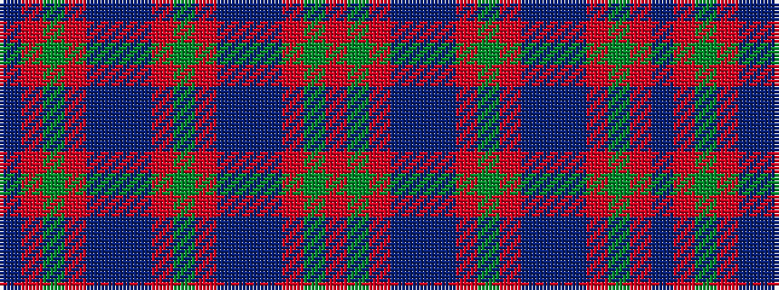

BRGRBBBRGRBBBRGR

It is a 16 stripe tartan.

<figure class="pat-woven">

<figcaption>idealised sample</figcaption>
</figure>

## Colour Sequence



## Tartans with this colour sequence

| Tartans |
|---------------|
| [Hebrides #6](/variants/s16/m3g11m3db2t2db11m2g2m2db11t2db2m3g11m3db2~x2/)|
||
