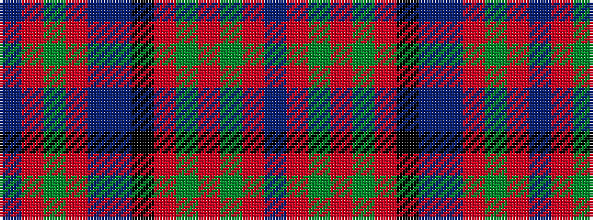

BRGRBBKRGRGRB

It is a 13 stripe tartan.

<figure class="pat-woven">

<figcaption>idealised sample</figcaption>
</figure>

## Colour Sequence



## Tartans with this colour sequence

| Tartans |
|---------------|
| [Nicolson](/setts/s13/db2r11g2r11g21r2k9t2db11r11g2r11db2~x2/)|
||
| [Nicolson/MacNicol](/setts/s13/db2r11dg2r11dg21r2k9t2db11r11dg2r11db2~x2/)|
||
