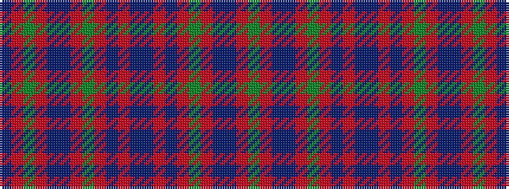

BRGRBBRGRBRBBRBRGRBBRG

It is a 22 stripe tartan.

<figure class="pat-woven">

<figcaption>idealised sample</figcaption>
</figure>

## Colour Sequence



## Tartans with this colour sequence

| Tartans |
|---------------|
| [Cumming](/variants/s22/dg10r3db12t1r10dg12r3db20r3db3t1r3db20r3dg12r12t1db12r3dg20r3db3~x2/)|
||
| [Cumming](/variants/s22/g10r3db12t1r10g12r3db20r3db3t1r3db20r3g12r12t1db12r3g20r3db3~x2/)|
||
| [Cumming of Glenorchy](/variants/s22/dg34r3db12t1r8dg12r3db20r3db3t1r3db20r3dg12r8t1db12r3dg22r3db3~x2/)|
||
| [Cumming, of Glenorchy](/variants/s22/g34r3db12t1r8g12r3db20r3db3t1r3db20r3g12r8t1db12r3g22r3db3~x2/)|
||
