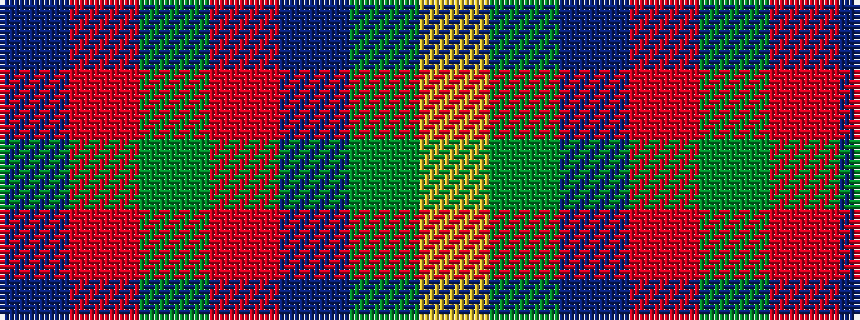

BRGRBGY

It is a 7 stripe tartan.

<figure class="pat-woven">

<figcaption>idealised sample</figcaption>
</figure>

## Colour Sequence



## Tartans with this colour sequence

| Tartans |
|---------------|
| [MacKintosh Hunting](/tartans/ly2dg12db6r3dg12r4db1/)|
||
| [MacKintosh Hunting](/setts/s7/ly2g12db6r3g12r4db1~x2/)|
||
| [MacKintosh, hunting](/setts/s7/db1r3g11r2db5g11ly1~x2/)|
||
