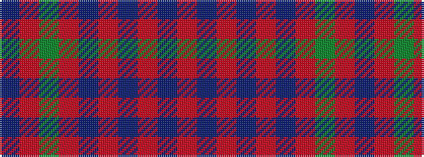

BRGRBRBRBR

It is a 10 stripe tartan.

<figure class="pat-woven">

<figcaption>idealised sample</figcaption>
</figure>

## Colour Sequence



## Tartans with this colour sequence

| Tartans |
|---------------|
| [Nithsdale (Dalgliesh)](/variants/s10/db16r3g3r10db24r3db3r3db3r10~x2/)|
||
