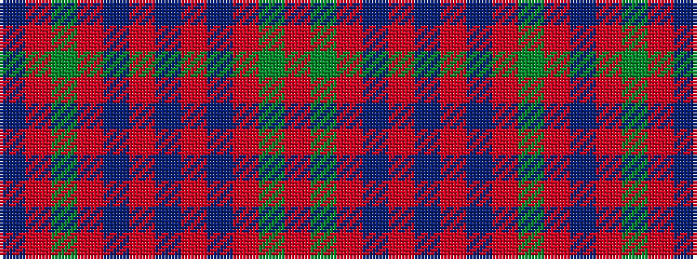

BRGRBRBRBRGR

It is a 12 stripe tartan.

<figure class="pat-woven">

<figcaption>idealised sample</figcaption>
</figure>

## Colour Sequence



## Tartans with this colour sequence

| Tartans |
|---------------|
| [Wilson's No.119](/setts/s12/r6g28r6dp2r6dp19r6dp2r6g28r6dp2~x2/)|
||
