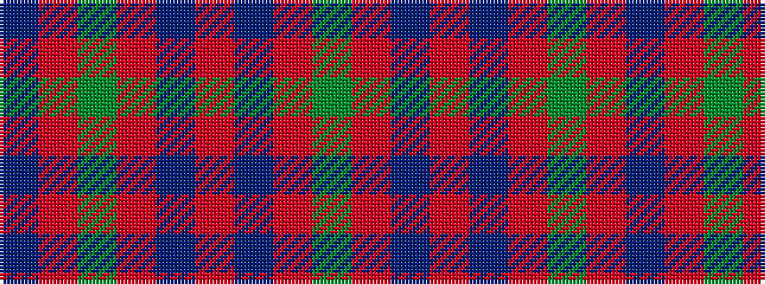

BRGRBRBRG

It is a 9 stripe tartan.

<figure class="pat-woven">

<figcaption>idealised sample</figcaption>
</figure>

## Colour Sequence



## Tartans with this colour sequence

| Tartans |
|---------------|
| [MacDonald #7](/setts/s9/dg2r2db1r24db6r3dg12r4db1~x2/)|
||
| [MacDonald 1](/setts/s9/g2r2db1r24db6r3g12r4db1~x2/)|
||
