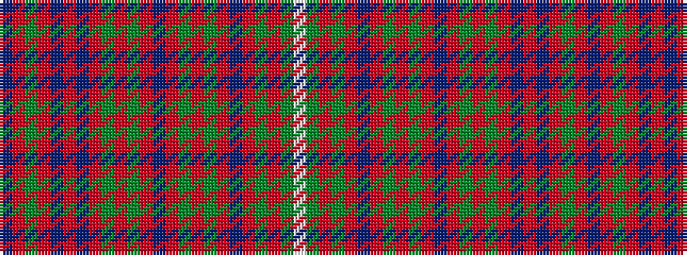

BRGRBRBRGRGRBRGRGRBRGRGW

It is a 24 stripe tartan.

<figure class="pat-woven">

<figcaption>idealised sample</figcaption>
</figure>

## Colour Sequence



## Tartans with this colour sequence

| Tartans |
|---------------|
| [Unidentified Plaid 1](/variants/s24/w4g10o9g4o1t3o1g69o10g2o1t4o1g2o18g2o1t3o1db2o99g4o5db2~x2/)|
||
