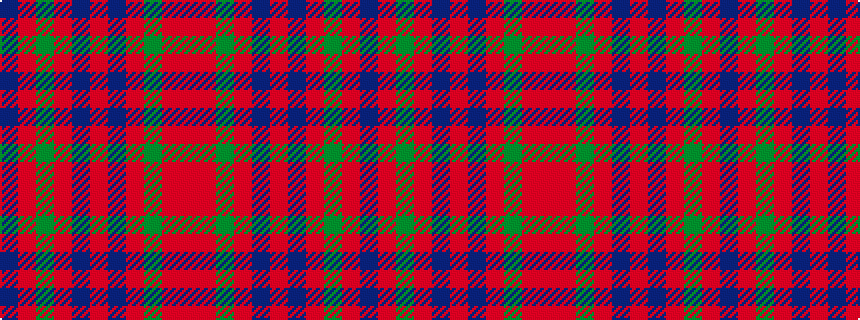

BRGRBRBRGRR

It is a 11 stripe tartan.

<figure class="pat-woven">

<figcaption>idealised sample</figcaption>
</figure>

## Colour Sequence



## Tartans with this colour sequence

| Tartans |
|---------------|
| [Buchanan, hunting](/variants/s11/db3o14g14o2db14o2db14o2g14o14r3~x2/)|
||
