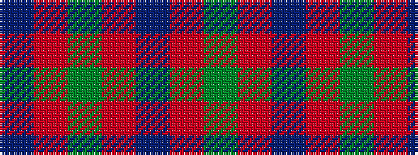

BRGRBRG

It is a 7 stripe tartan.

<figure class="pat-woven">

<figcaption>idealised sample</figcaption>
</figure>

## Colour Sequence



## Tartans with this colour sequence

| Tartans |
|---------------|
| [GS Gaelic School (School)](/setts/s7/dt30r5g30r22dt30r5g4/)|
||
| [Glasgow](/setts/s7/g25r4db24r21g25r3db4~x2/)|
||
| [Glasgow #2](/setts/s7/dg25r4db24r21dg25r3db4~x2/)|
||
| [Glasgow, Ciity of (District)](/setts/s7/dg28r4dp25r22dg27r4dp2~x2/)|
||
| [Glasgow, City of](/setts/s7/g28r4dp25r22g27r4dp2~x2/)|
||
| [Glasgow, Rock and Wheel](/setts/s7/g25m4db24m21g25m4db2~x2/)|
||
| [Madder](/setts/s7/dg28r4dp27r27dg28r5dp2~x2/)|
||
