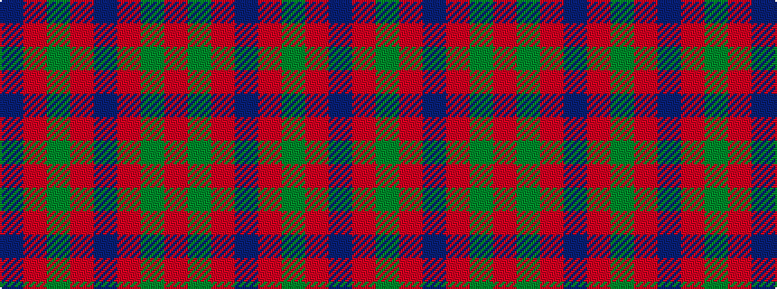

BRGRBRGR

It is a 8 stripe tartan.

<figure class="pat-woven">

<figcaption>idealised sample</figcaption>
</figure>

## Colour Sequence



## Tartans with this colour sequence

| Tartans |
|---------------|
| [Glasgow District Tartan](/variants/s8/o10g14o3db14o10g14o3db4~x2/)|
||
