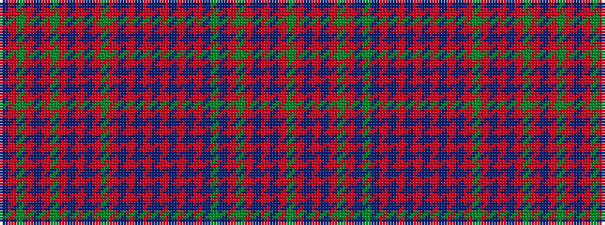

BRGRBRGRBRBRGRBRBRBRBRBRBGBRGRBRBRG

It is a 35 stripe tartan.

<figure class="pat-woven">

<figcaption>idealised sample</figcaption>
</figure>

## Colour Sequence



## Tartans with this colour sequence

| Tartans |
|---------------|
| [Murray of Polmaise](/variants/s35/g3r3t9r12t1r1g1r1t1g1t6r1t1r1t1r1t1r1t6r1t1r1g1r1t1r12t9r3g3r7t3r3g1r4t3~x4/)|
||
