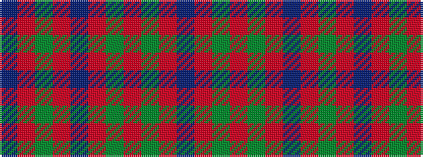

BRGRBRGRGRB

It is a 11 stripe tartan.

<figure class="pat-woven">

<figcaption>idealised sample</figcaption>
</figure>

## Colour Sequence



## Tartans with this colour sequence

| Tartans |
|---------------|
| [Glasgow (Error)](/setts/s11/db1r2g12r10db12r2g12r10g12r2db1~x4/)|
||
