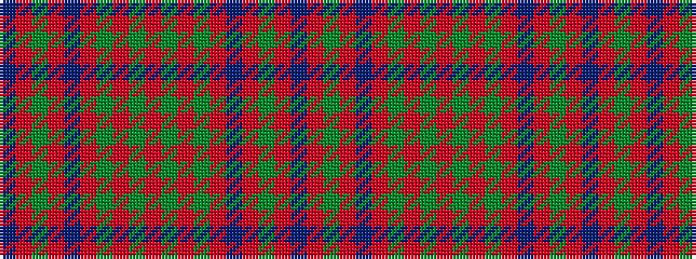

BRGRBRGRGRGRGRBRGRB

It is a 19 stripe tartan.

<figure class="pat-woven">

<figcaption>idealised sample</figcaption>
</figure>

## Colour Sequence



## Tartans with this colour sequence

| Tartans |
|---------------|
| [Na Fir Dileas](/setts/s19/n15m39y15m7n39m4y4m39y4m4y4m39y4m4n39m7y15m39n14/)|
||
