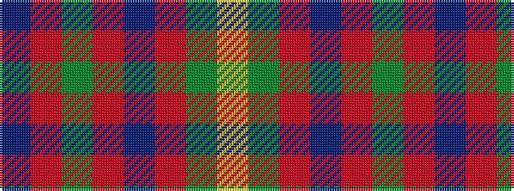

BRGRBRGY

It is a 8 stripe tartan.

<figure class="pat-woven">

<figcaption>idealised sample</figcaption>
</figure>

## Colour Sequence



## Tartans with this colour sequence

| Tartans |
|---------------|
| [Prince George's Police Pipe Band](/variants/s8/db42r2y16r2db6r2y8lo3~x2/)|
||
