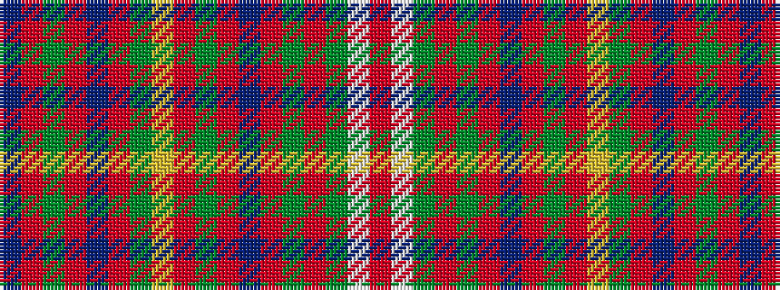

BRGRBRGYRGRBRGRGWR

It is a 18 stripe tartan.

<figure class="pat-woven">

<figcaption>idealised sample</figcaption>
</figure>

## Colour Sequence



## Tartans with this colour sequence

| Tartans |
|---------------|
| [Hebridean, South Uist](/setts/s18/db19r2g3r2db2r20g1ly1r1g2r2db18r2g2r22g3w1r3~x2/)|
||
