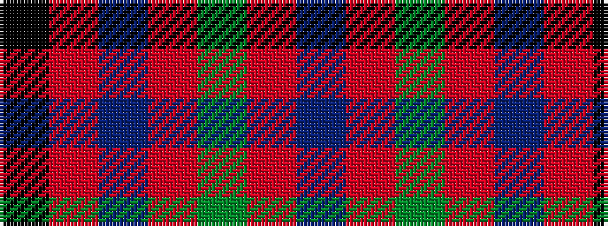

BRGRBRK

It is a 7 stripe tartan.

<figure class="pat-woven">

<figcaption>idealised sample</figcaption>
</figure>

## Colour Sequence



## Tartans with this colour sequence

| Tartans |
|---------------|
| [MacBean, MacElvain](/variants/s7/k2r12db6r3g12r4db1~x2/)|
||
| [MacBean/MacElvain](/variants/s7/k2r12db6r3dg12r4db1~x2/)|
||
