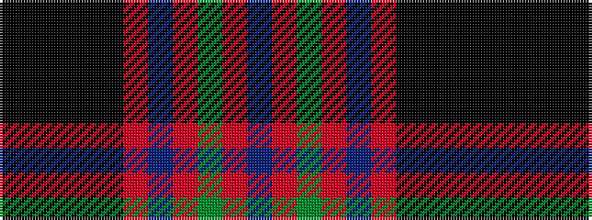

BRGRBRKKKKK

It is a 11 stripe tartan.

<figure class="pat-woven">

<figcaption>idealised sample</figcaption>
</figure>

## Colour Sequence



## Tartans with this colour sequence

| Tartans |
|---------------|
| [Torridon Dress Tartan Tartan Number: 8185. Earliest known date: See products available Copyright © Blair Urquhart, Comrie, 2015](/setts/s11/k2k28k4k1k4m16t3m2y2m3t1~x2/)|
||
