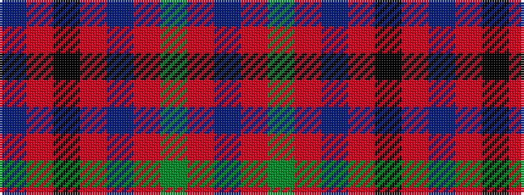

BRGRBRKRB

It is a 9 stripe tartan.

<figure class="pat-woven">

<figcaption>idealised sample</figcaption>
</figure>

## Colour Sequence



## Tartans with this colour sequence

| Tartans |
|---------------|
| [MacPherson Hunting](/setts/s9/db1r1k8r1db1r1y8r1db1~x2/)|
||
| [MacPherson of Pitmain](/setts/s9/db1r1k8r1db1r1y8r1db1~x4/)|
||
