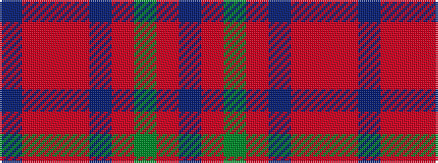

BRGRBRRRB

It is a 9 stripe tartan.

<figure class="pat-woven">

<figcaption>idealised sample</figcaption>
</figure>

## Colour Sequence



## Tartans with this colour sequence

| Tartans |
|---------------|
| [MacPherson Gathering 1996](/variants/s9/b3r2o16r2b3r2g16r2b3~x4/)|
||
